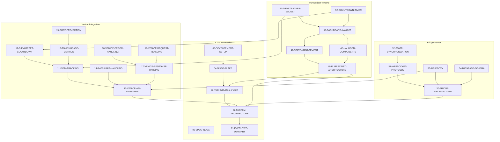

# 91-DEPENDENCY-GRAPH: Specification and Code Dependencies

## Overview

This document maps dependencies between specifications and defines the import structure for the codebase.

---

## Specification Dependency Graph



---

## Layer Dependencies

```
┌─────────────────────────────────────────────────────────────────────────────┐
│                           DEPENDENCY FLOW                                   │
├─────────────────────────────────────────────────────────────────────────────┤
│                                                                             │
│  ┌─────────────────────────────────────────────────────────────────────┐   │
│  │                        FRONTEND (PureScript)                        │   │
│  │  Dashboard → Components → State → WebSocket Client → Types          │   │
│  └─────────────────────────────────────────────┬───────────────────────┘   │
│                                                │                            │
│                                           WebSocket                         │
│                                           JSON-RPC                          │
│                                                │                            │
│  ┌─────────────────────────────────────────────▼───────────────────────┐   │
│  │                      BRIDGE SERVER (Node.js)                        │   │
│  │  Routes → Handlers → Services → Database → Venice API               │   │
│  └─────────────────────────────────────────────┬───────────────────────┘   │
│                                                │                            │
│                                            HTTP/REST                        │
│                                                │                            │
│  ┌─────────────────────────────────────────────▼───────────────────────┐   │
│  │                      OPENCODE PLUGIN (JS)                           │   │
│  │  Event Hooks → SDK → Plugin Interface                               │   │
│  └─────────────────────────────────────────────────────────────────────┘   │
│                                                                             │
└─────────────────────────────────────────────────────────────────────────────┘
```

---

## Spec Category Dependencies

### Foundation → Everything

```
02-SYSTEM-ARCHITECTURE
├── 10-VENICE-API-OVERVIEW
├── 20-OPENCODE-ARCHITECTURE  
├── 30-BRIDGE-ARCHITECTURE
└── 40-PURESCRIPT-ARCHITECTURE
```

### Venice → Tracking → UI

```
10-VENICE-API-OVERVIEW
├── 11-DIEM-TRACKING
│   ├── 51-DIEM-TRACKER-WIDGET
│   └── 15-COST-PROJECTION
├── 12-DIEM-RESET-COUNTDOWN
│   └── 52-COUNTDOWN-TIMER
├── 13-TOKEN-USAGE-METRICS
│   └── 53-TOKEN-USAGE-CHART
└── 14-RATE-LIMIT-HANDLING
    └── 18-VENICE-ERROR-HANDLING
```

### Session Management Chain

```
23-SESSION-MANAGEMENT
├── 24-MULTI-SESSION-MANAGEMENT
│   └── 54-SESSION-PANEL
├── 25-SESSION-BRANCHING
│   └── 63-TIMELINE-VIEW
├── 64-SNAPSHOT-MANAGEMENT
└── 65-SESSION-RECORDING
```

### Plugin → Events → State

```
21-PLUGIN-SYSTEM
├── 22-SDK-INTEGRATION
├── 26-PLUGIN-DEVELOPMENT-GUIDE
└── Events flow to:
    ├── 32-STATE-SYNCHRONIZATION
    └── 41-STATE-MANAGEMENT
```

---

## Code Import Structure

### Bridge Server Imports

```typescript
// bridge/src/index.ts - Entry point
import { createServer } from './server';
import { initDatabase } from './db';
import { initWebSocket } from './websocket';
import { createVeniceClient } from './venice';
import { loadConfig } from './config';

// Dependency order:
// 1. config (no deps)
// 2. db (config)
// 3. venice (config)
// 4. websocket (db, venice)
// 5. server (websocket, db, venice)
```

```
bridge/src/
├── index.ts              → server.ts, db/, websocket/, venice/
├── config.ts             → (external: dotenv)
├── server.ts             → websocket/, routes/, middleware/
├── db/
│   ├── index.ts          → schema.ts, migrations/, queries/
│   ├── schema.ts         → (no internal deps)
│   ├── migrations/       → schema.ts
│   └── queries/
│       ├── sessions.ts   → schema.ts
│       ├── messages.ts   → schema.ts
│       └── balance.ts    → schema.ts
├── websocket/
│   ├── index.ts          → protocol.ts, handlers/
│   ├── protocol.ts       → (shared types)
│   └── handlers/
│       ├── session.ts    → db/queries/, venice/
│       ├── balance.ts    → db/queries/, venice/
│       └── state.ts      → db/queries/
├── venice/
│   ├── index.ts          → client.ts, parser.ts, errors.ts
│   ├── client.ts         → config.ts, errors.ts
│   ├── parser.ts         → (shared types)
│   └── errors.ts         → (no internal deps)
└── routes/
    ├── health.ts         → db/, venice/
    └── metrics.ts        → db/
```

### Frontend Imports

```purescript
-- frontend/src/Main.purs - Entry point
module Main where

import App.Router (router)
import App.Store (createStore)
import App.WebSocket (connect)
import App.State (initialState)

-- Dependency order:
-- 1. Types (no deps)
-- 2. State (Types)
-- 3. WebSocket (Types, State)
-- 4. Components (Types, State)
-- 5. Router (Components)
-- 6. Main (Router, Store, WebSocket)
```

```
frontend/src/
├── Main.purs             → App.Router, App.Store, App.WebSocket
├── App/
│   ├── Router.purs       → Pages/*, Component/*
│   ├── Store.purs        → State.purs, Types/*
│   ├── State.purs        → Types/*
│   └── WebSocket.purs    → Types/Protocol.purs, State.purs
├── Types/
│   ├── Session.purs      → (no internal deps)
│   ├── Balance.purs      → (no internal deps)
│   ├── Message.purs      → Session.purs
│   └── Protocol.purs     → Session.purs, Balance.purs, Message.purs
├── Component/
│   ├── Dashboard.purs    → DiemWidget.purs, SessionPanel.purs, ...
│   ├── DiemWidget.purs   → Types/Balance.purs
│   ├── Countdown.purs    → Types/Balance.purs
│   ├── SessionPanel.purs → Types/Session.purs, Types/Message.purs
│   └── ...
├── Pages/
│   ├── Home.purs         → Component/Dashboard.purs
│   ├── Session.purs      → Component/SessionPanel.purs
│   └── Settings.purs     → Component/Settings.purs
└── FFI/
    ├── WebSocket.purs    → (external JS)
    ├── LocalStorage.purs → (external JS)
    └── Recharts.purs     → (external JS)
```

---

## Circular Dependency Prevention

### Forbidden Patterns

```
❌ NEVER:
   Component A → Component B → Component A
   
❌ NEVER:
   Module → Types → Module
   
❌ NEVER:
   db/queries → websocket/handlers → db/queries
```

### Resolution Strategies

```
✅ Extract shared logic to common module:
   Component A ─┐
                ├──→ Common Module
   Component B ─┘

✅ Use type-only imports:
   Module A → Types (shared)
   Module B → Types (shared)

✅ Dependency injection:
   Handler receives deps, doesn't import them
```

---

## Build Order

### Bridge Server

```bash
# TypeScript compilation order
1. shared/types/**/*.ts       # Shared type definitions
2. bridge/src/config.ts       # Configuration
3. bridge/src/db/**/*.ts      # Database layer
4. bridge/src/venice/**/*.ts  # Venice API client
5. bridge/src/websocket/**/*.ts # WebSocket handlers
6. bridge/src/routes/**/*.ts  # HTTP routes
7. bridge/src/server.ts       # Server setup
8. bridge/src/index.ts        # Entry point
```

### Frontend

```bash
# PureScript compilation order
1. Types/**/*.purs            # Type definitions
2. FFI/**/*.purs              # Foreign function interfaces
3. App/State.purs             # State management
4. App/WebSocket.purs         # WebSocket client
5. Component/**/*.purs        # UI components
6. Pages/**/*.purs            # Page compositions
7. App/Router.purs            # Router
8. Main.purs                  # Entry point
```

---

## Module Graph Visualization

### Generate with Madge (TypeScript)

```bash
# Install madge
npm install -g madge

# Generate dependency graph
madge --image bridge-deps.svg bridge/src/index.ts

# Check for circular deps
madge --circular bridge/src/
```

### Generate with PureScript

```bash
# Dependency graph is built into spago
spago graph > frontend-deps.dot
dot -Tsvg frontend-deps.dot -o frontend-deps.svg
```

---

## Related Specifications

- `02-SYSTEM-ARCHITECTURE.md` - Overall architecture
- `07-PROJECT-STRUCTURE.md` - Directory layout
- `40-PURESCRIPT-ARCHITECTURE.md` - Frontend structure

---

*"Understand the dependencies before you write the code."*
